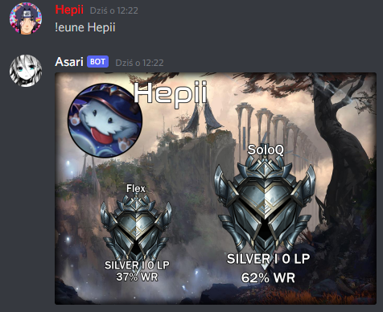
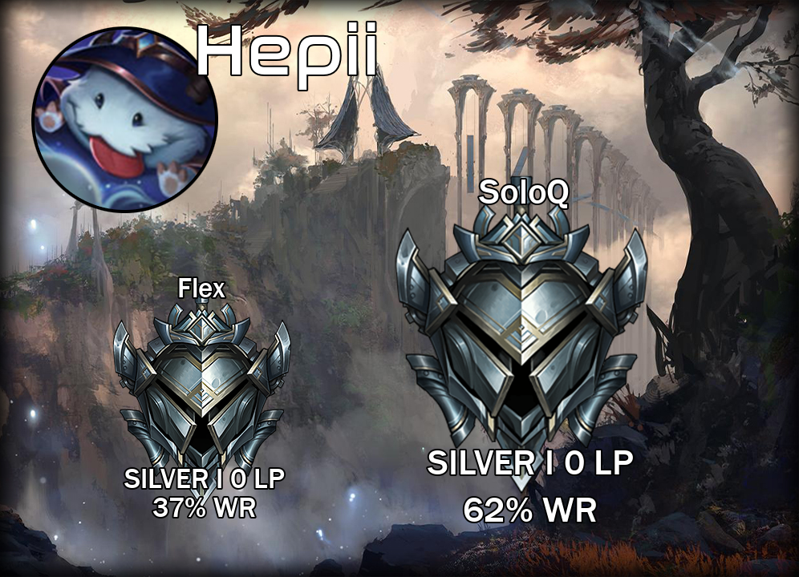

# Discord-Bot-League-of-Legends
## Table of contents
* [General Info](#general_info)
* [Images](#images)
* [Contact](#contact)
* [Technologies](#technologies)
## General info
I've made quick accces to user division in game League of Legends. Everyone is using Discord so bot which return data to user with information about division is super solution for gamers. You dont have to open your browser to search division anymore. Just use command (!help) and bot will do everything for you. (I am terrible graphic so image dont look good. If you want to design new look contact with me)

## Images
 
.png) 
 

## Contact
Discord: Hepii#2137  

## Technologies
* Python
* Discord python library
